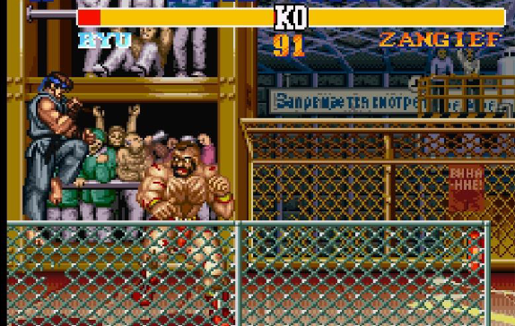
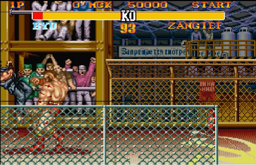

# TurboFighter AI

AI-powered Street Fighter II Turbo bot that learns controller behavior from gameplay data and predicts button inputs in real time.

## Project Overview

This project combines emulator game-state data with supervised learning:

1. Gameplay states are recorded in `GameState.csv`.
2. A neural network is trained using `trainingcode.py`.
3. The trained model is saved as `game_model.h5`.
4. During live play, `bot.py` loads the model and predicts button actions for Player 1.

## Repository Contents

- `bot.py`: Real-time bot inference logic.
- `trainingcode.py`: Data preprocessing, model training, and evaluation.
- `GameState.csv`: Recorded gameplay state/action dataset.
- `game_model.h5`: Trained TensorFlow model used by the bot.
- `Report.pdf`: Project report document (kept out of git history by `.gitignore`).

## Requirements

- Python 3.10 (recommended for TensorFlow compatibility)
- BizHawk emulator
- Street Fighter II Turbo ROM

## Python Dependencies

Install dependencies with:

```bash
pip install pandas matplotlib numpy tensorflow scikit-learn keyboard
```

Package purpose:

- `pandas`: tabular data loading and preprocessing
- `matplotlib`: training metric visualization
- `numpy`: numerical operations
- `tensorflow`: neural network training and inference
- `scikit-learn`: scaling and train/test split
- `keyboard`: keyboard input handling

## How Training Works

`trainingcode.py` performs the following pipeline:

1. Loads `GameState.csv`.
2. Cleans invalid rows and non-numeric fields.
3. Normalizes game-state features.
4. Trains a multi-output MLP model for 12 controller buttons.
5. Evaluates test performance and saves `game_model.h5`.

Run training:

```bash
python trainingcode.py
```

## How to Run the Bot

1. Open BizHawk (`EmuHawk.exe`).
2. Load the ROM: Street Fighter II Turbo.
3. Open Tools -> Tool Box.
4. Start your Python-side integration (controller/runner setup) that instantiates `Bot` from `bot.py`.
5. Activate the bot from the BizHawk tooling UI.

When connected correctly, the bot predicts actions frame-by-frame from live game state.


## Gameplay Screenshots

### Match Snapshot 1


### Match Snapshot 2



